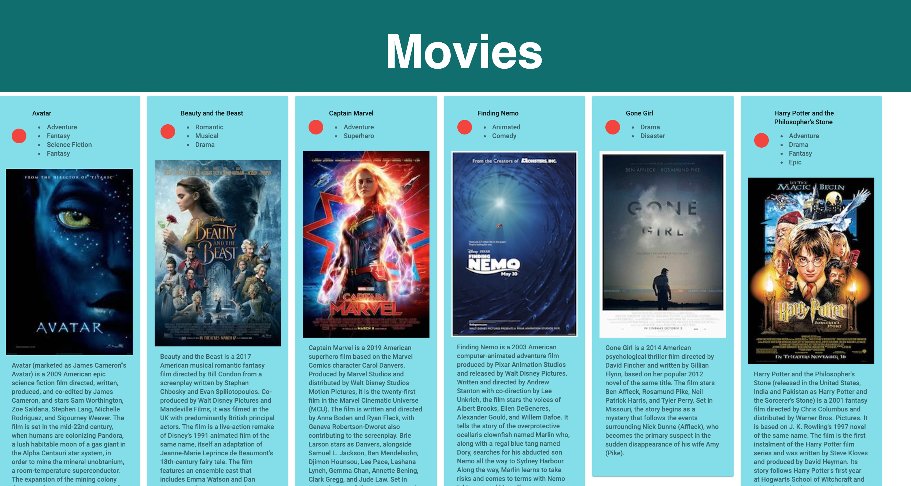
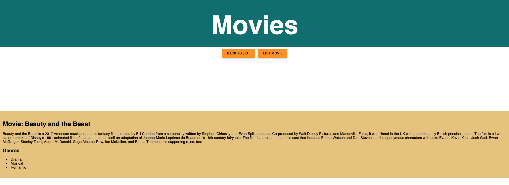

# Project Name

Movies - Sagas

### Description

Movies saga app allows the users  to click on a movie and it moves to the details page where it displays the movie details and when you click the back you get transferred to home page. Edit allows you to edit your move details and movie title.

### Getting Started

### Prerequisites

Before getting started, install the following software

- Node.js
- Axios
- Express
- React
- Redux
- Saga
- Create a database and tables
- Create a junction table

### Wireframes

- Home Page

    

- Details

    

- Edit

    